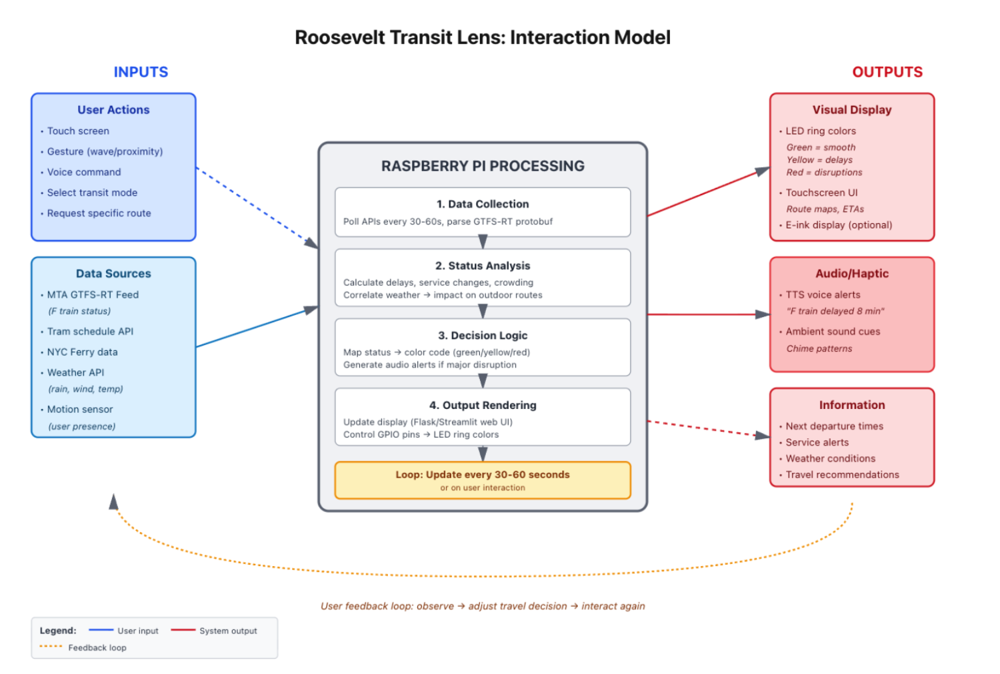
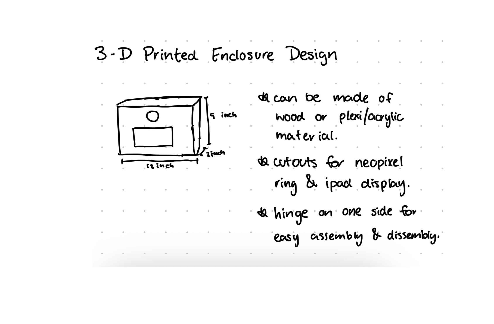
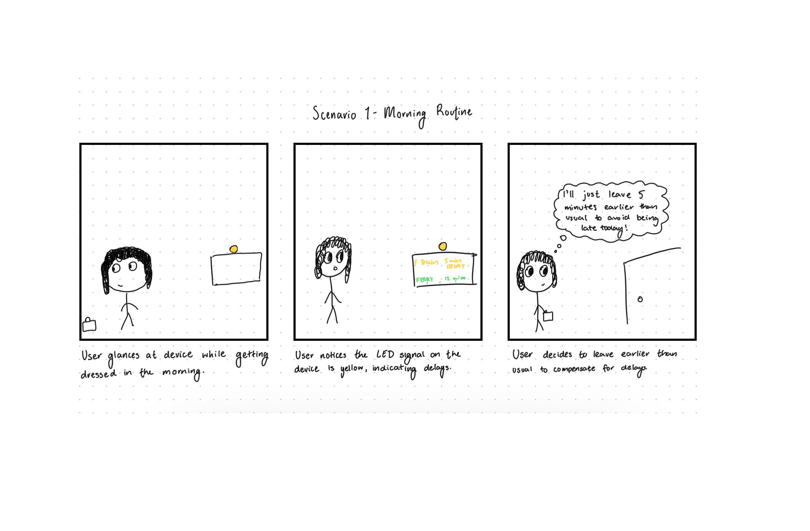
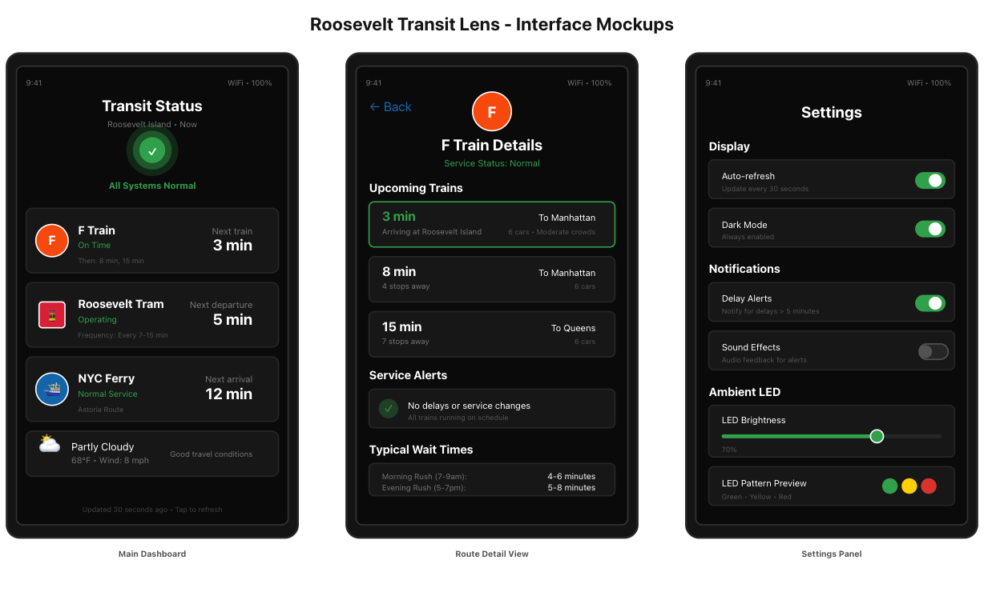

# Roosevelt Transit Lens - Final Project

[Project Plan](#project-plan) | [Functioning Project](#functioning-project) | [Documentation of Design Process](#documentation-of-design-process) | [Archive of All Code and Design Patterns](#archive-of-all-code-and-design-patterns) | [Video Demo](#video-demo) | [Reflections on Process](#reflections-on-process) | [Group Work Distribution and AIUsage](#group-work-distribution-and-ai-usage)

## Project Plan

This project will be done individually by Jaspreet

### Big Idea

Roosevelt Island sits between Manhattan and Queens — connected by subway (F line), tramway, and ferry. Despite its small size, residents rely heavily on these few modes of transit, often without clear visibility into real-time conditions. Current transit apps provide information but require active checking and don't create ambient awareness of transit conditions across the city.

The Roosevelt Transit Lens is an interactive physical transit map powered by a Raspberry Pi that transforms how people understand and interact with real-time NYC transit data. Rather than checking a phone app, users can touch stations directly on a physical subway map to see live transit conditions through an ambient LED display and detailed information screen.

**The Interactive Experience**

- Physical NYC Subway Map with copper touch sensors behind 12 key stations
- Touch any station → immediate visual feedback through NeoPixel LED ring
- LED ring visualization shows train arrival times spatially (each LED = 1 minute countdown)
- Secondary display (iPad Mini 6) shows detailed train schedules, alerts, and weather
- Ambient mode provides passive awareness of overall transit health when not actively using

Design Principles:
- Ambient First: LED shows overall status passively; detailed data only when touched
- Spatial Mapping: LED position corresponds to time until arrival (intuitive countdown)
- Progressive Disclosure: Touch reveals more detail; no information overload
- Focused Context: 12 strategically chosen stations cover Roosevelt Island commute + major Manhattan hubs

### Timeline

| Date | Milestone |
|------|-----------|
| Nov 10 | Project plan presentation |
| Nov 13 | Peer feedback, refine scope based on class input |
| Nov 14-20 | Design iterations: Verplank diagram, storyboards, wiring diagram |
| Nov 21-27 | Implement core functionality: MTA API integration, basic visualization |
| Nov 28 | First working prototype with one live data feed (F train status) |
| Nov 29-Dec 1 | Add multimodal feedback: LED ring integration, touchscreen interface |
| Dec 1 | Functional check-off: interactive Pi device displays live transit info |
| Dec 2-5 | User testing with 2-3 Roosevelt Island residents, iterate based on feedback |
| Dec 6-7 | Finalize design, create physical enclosure, polish interactions |
| Dec 8 | Final presentation + demo video |
| Dec 9-15 | Complete documentation, code cleanup, reflections |
| Dec 15 | Submit final documentation and reflection |

### Parts Needed

**Computing & Backend:**
- 1x Raspberry Pi 5 (already owned)
- 1x 32GB MicroSD Card with Raspberry Pi OS
- 1x Power Supply for Raspberry Pi (USB-C, 5V 3A)
- WiFi connection (for API access and web serving)

**Interactive Map Components:** 
- 1x MPR121 Capacitive Touch Sensor (already owned) - detects station touches
- Copper tape 1/4" or 1/2" wide (already owned) - creates touch pads behind stations
- 1x NYC Subway Map (18"×24" or larger) - printed or purchased poster
- 1x Foam board or acrylic backing (18"×24") - mounting substrate
- Clear contact paper or lamination - protects map surface
- Jumper wires (Female-Female) - connects copper pads to MPR121

**Display Components:**
- 1x display for detailed information
- 1x NeoPixel Ring - 12 RGB LED (already owned) - ambient status visualization
- iPad stand or wall mount - positions display near map

**Physical Construction:**
- Double-sided tape and hot glue - securing components
- Cable management clips - organizing wires
- Frame or shadow box for finished presentation (laser cut)

**Software/APIs:**
- MTA GTFS-Realtime API (free) - live train data
- NYC Open Data API (free) - ferry schedules
- OpenWeather API (free tier) - weather correlation
- Python libraries: requests, protobuf, Flask, adafruit-circuitpython-mpr121, adafruit-circuitpython-neopixel
- Web technologies: HTML5, CSS3, JavaScript (for iPad interface)

**LED Visualization Design**
Ambient Mode (Default):
- Solid green = All transit systems normal
- Pulsing yellow = Some delays detected
- Pulsing red = Major service disruptions
- Breathing gray = System offline


<!-- EDIT -->
Station Selection (12 Touch Points)
Local to Roosevelt Island (6 stations):
1. Roosevelt Island (F)
2. Lexington Av/63 St (F, Q)
3. 21 St-Queensbridge (F)
4. Queens Plaza (E, M, R)
5. Roosevelt Island Tram
6. Roosevelt Island Ferry

Major Manhattan Hubs (6 stations):
7. Times Sq-42 St (1, 2, 3, 7, N, Q, R, W, S)
8. Grand Central-42 St (4, 5, 6, 7, S)
9. 34 St-Herald Sq (B, D, F, M, N, Q, R, W)
10. Union Sq-14 St (4, 5, 6, L, N, Q, R, W)
11. Canal St (J, Z, N, Q, R, W, 6)
12. WTC/Fulton St (A, C, E, 2, 3, 4, 5, J, Z, R, W)

### Risks/Contingencies & Fall-back Plan
**Primary Risks:**
1. **Copper Touch Pad Reliability:** Capacitive sensing can be finicky with varying materials
   - Contingency: Test different copper pad sizes (1"-2" diameter) and spacing
   - Fall-back: Use physical buttons if capacitive touch proves unreliable
2. **MPR121 Sensitivity Tuning:** May detect false touches or miss real ones
   - Contingency: Adjust threshold values in software, add debouncing
   - Fall-back: Reduce number of stations to improve signal quality
3. **Map Construction Complexity:** Aligning copper pads precisely behind stations
   - Contingency: Create cardboard prototype first, test before final assembly
   - Fall-back: Simplify to 6 stations if 12 proves too complex
4. **I2C Bus Conflicts:** MPR121 and potential future sensors share I2C
   - Contingency: Carefully manage I2C addresses, test each device individually
   - Fall-back: Prioritize touch sensor over additional sensors

**Minimal Viable Product (MVP):**
If major issues arise, the core functionality will be: 6 touch-sensitive stations (Roosevelt Island area only), LED ring showing station-specific countdowns, basic web interface showing train times. This still demonstrates the central concept of spatial, interactive transit visualization. 

Future Expansion Possibilities

Multiple MPR121 boards: Scale to 48+ stations (4 boards × 12 inputs)
Zone-based navigation: Touch neighborhood zones to filter stations
Historical patterns: Track which stations are touched most, suggest optimal routes
Sound feedback: Subway door chime when station selected
Weather integration: LED patterns change based on rain/snow affecting outdoor transit
Haptic feedback: Vibration motor confirms touch

### Iteration Note
During the first phase of the project, the Roosevelt Transit Lens was conceived as a multimodal ambient display combining a touchscreen interface, LED ring, and optional audio cues to provide a passive sense of transit conditions around Roosevelt Island. Early prototypes successfully demonstrated real-time F-train status, LED color feedback, and weather integration. See the [initial design document](READMEv1.md) for earlier documentation.

The project plan was updated to design a better relationship between people and transit information. During the functional check-off and after speaking with some peers, I want to create something dynamic that lives in the physical environment, encourages glanceable, ambient interaction, uses spatial touch instead of screens, and feels like an object, not an app. The new scope makes real-time transit status intuitive and embodied, not digital and cognitive. This reframing led to the new direction where I used a physical NYC subway map and created touch-sensitive stations and spatial LED visualizations. 

## Functioning Project


*Caption: Roosevelt Transit Lens installed and operational*

### Key Features Demonstrated:
- Real-time MTA F train status display
- Ambient LED ring showing transit conditions
- Touchscreen interface for exploring routes
- Integration with weather data

### Verplank Diagram


*How users interact with the device: touch/gesture for active exploration, glance at LEDs for passive awareness or listen for alerts*


*What the device looks like: the raspberry pi and other wirings will be hidden inside behind the frame with a small cutout for wires*

### Storyboards

#### Scenario 1-4

*Storyboard 1: User checks device while getting ready; yellow LED indicates delays; user adjusts departure time
Storyboard 2: Red LED catches user's attention before leaving; touchscreen shows alternative routes
Storyboard 3: Device provides peripheral awareness throughout the day; user unconsciously learns transit patterns
Storyboard 4: Rainy day so the device recommends covered transit options based on weather conditions*

### Wiring Diagram


*Complete wiring schematic showing Raspberry Pi GPIO connections to touchscreen, LED ring, sensors, and power supply*

### Interface Mockups


*Left to right: Main dashboard view, route detail view, settings panel*

## Archive of All Code and Design Patterns

**View source code:** [GitHub Repository](https://github.com/yourusername/roosevelt-transit-lens)

### Project Structure:
```
roosevelt-transit-lens/
├── src/
│   ├── data_fetcher.py      # MTA GTFS-RT and NYC Open Data API integration
│   ├── visualization.py     # Transit status visualization with Matplotlib/Plotly
│   ├── ambient_controller.py # LED ring control based on transit status
│   ├── main_app.py          # Flask/Streamlit interface coordination
│   └── config.py            # API keys, update intervals, GPIO pin assignments
├── tests/
│   ├── api_test.py
│   └── led_patterns_test.py
├── images/                   # Documentation images
├── requirements.txt
└── README.md
```

### Development Progress:

**API Integration Demo:**

*Successful data retrieval from MTA GTFS-Realtime feed showing F train status*

**LED Pattern Tests:**

*Testing different LED color patterns for various transit conditions*

**Hardware Assembly:**

*Connecting components: Raspberry Pi, touchscreen, and LED ring*

**Functional Checkoff - Tech Demo**


*Click image to watch: Working prototype displaying live MTA data with LED ambient feedback*

## Video Demo

[](https://youtu.be/your-final-video-id)
*Click to watch the complete demonstration*

**Video includes:**
- Device overview and physical design
- User interaction with touchscreen interface
- Real-time transit data updates
- LED ambient feedback responding to changing conditions
- Audio alert demonstration
- User testimonial from testing session

## Reflections on Process

### Design Phase
I began by developing a clear concept for why ambient transit awareness would be valuable for Roosevelt Island residents. The Verplank diagram helped me think through different interaction modalities (touch, look, listen) and when each would be most appropriate. Creating storyboards for four distinct scenarios revealed that users need both active exploration (touchscreen) and passive awareness (LEDs). These aren't redundant but instead serve different contexts.

Presenting the initial proposal to the class generated valuable feedback. This led me to adjust how I would wire the project and inspired me to include an enclosure for the RaspberryPi and ring light. 

### Technical Implementation
The most significant challenge was integrating the MTA GTFS-Realtime API. The protocol buffer format required careful parsing, and [describe specific technical hurdles]. I overcame this by [solution approach].

Hardware integration presented [describe challenges with GPIO, LED control, etc.]. A particularly tricky issue was [specific problem], which I eventually solved by [solution].

### User Testing Insights
The original idea 
- **Glanceability**: Users appreciated being able to understand transit conditions without actively checking, confirming the value of ambient feedback
- **Confusion points**: [Describe what confused users and how you iterated]
- **Unexpected use cases**: [Describe behaviors you didn't anticipate]
- **Feature requests**: Testers suggested [additional features they wanted]

Based on this feedback, I made the following iterations: [describe changes]

### Key Learnings
1. **Real-time APIs are unpredictable**: Building robust error handling and caching was essential
2. **Ambient information has limits**: Too much passive information becomes noise; finding the right balance was crucial
3. **Context matters**: Transit decisions depend on many factors beyond just delay times (weather, time of day, crowding)
4. **Hardware debugging**: [Specific lessons about Raspberry Pi GPIO, LED control, etc.]

### Future Improvements
If I were to continue this project, I would:
- Add [feature 1]
- Improve [aspect 2]
- Explore [idea 3]

The most valuable aspect of this project was learning how to translate abstract transit data into intuitive, ambient awareness that actually influences user behavior.

## Group Work Distribution and AI Usage

This is an individual project. All design, development, and testing conducted by Jaspreet. 

AI was used to create the storboard diagrams and assisted in developing the verplank diagram. ChatGPT was also used to create the test_led.py file to make sure that the LEDs were functioning prior to adding them into the project. All other usages of AI are documented in the [WendyTA FinalProject AI interaction log](../WendyTA/logs/FinalProject_ai_interaction_log.md).