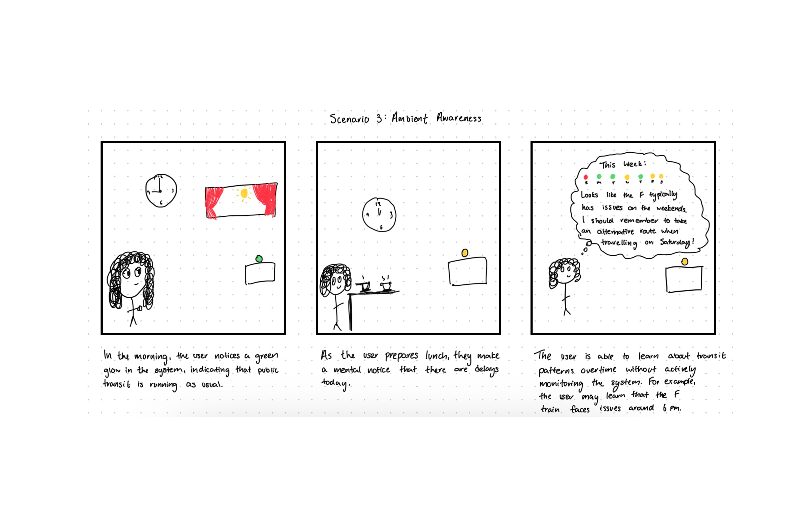
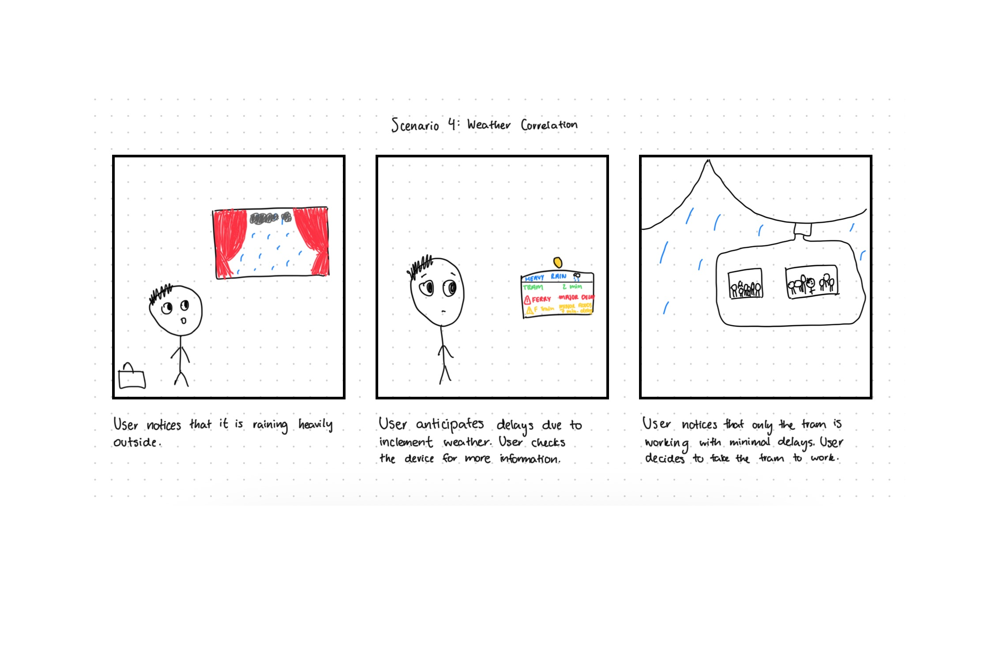

TODO:
* WIRING DIAGRAM


# Roosevelt Transit Lens - Final Project

[Project Plan](#project-plan) | [Functioning Project](#functioning-project) | [Documentation of Design Process](#documentation-of-design-process) | [Archive of All Code and Design Patterns](#archive-of-all-code-and-design-patterns) | [Video Demo](#video-demo) | [Reflections on Process](#reflections-on-process) | [Group Work Distribution](#group-work-distribution)

## Project Plan

This project will be done individually by [Your Name]

### Big Idea

Roosevelt Island sits between Manhattan and Queens — connected by subway (F line), tramway, and ferry. Despite its small size, residents rely heavily on these few modes of transit, often without clear visibility into real-time conditions. Current transit apps provide information but require active checking and don't create ambient awareness of conditions.

The **Roosevelt Transit Lens** is an interactive, ambient display powered by a Raspberry Pi that visualizes live NYC transit data (subway, tram, ferry) and correlates it with environmental conditions to give users an intuitive sense of mobility around Roosevelt Island. The device acts as a "situational awareness hub" — passively communicating when it's a good time to travel, how crowded stations might be, and how environmental factors impact routes.

**Why combine multiple feedback modes?**

- **Visual Display** provides detailed information when users actively seek it (departure times, delays, route options)
- **Ambient LED Feedback** offers passive awareness without demanding attention — users can glance and understand conditions instantly (green = smooth, yellow = delays, red = disruptions)
- **Optional Audio Cues** deliver timely alerts for significant changes without requiring visual attention (useful when preparing to leave)

These three interaction modes are complementary rather than redundant. Each serves different user needs:
- Active exploration (touchscreen) when planning a trip
- Passive awareness (LEDs) for ongoing background monitoring
- Alert notifications (audio) for time-sensitive updates

The device transforms transit data from something users must actively check into ambient information that naturally informs daily routines and departure decisions.

### Timeline

| Date | Milestone |
|------|-----------|
| Nov 10 | Project plan presentation |
| Nov 13 | Peer feedback, refine scope based on class input |
| Nov 14-20 | Design iterations: Verplank diagram, storyboards, wiring diagram |
| Nov 21-27 | Implement core functionality: MTA API integration, basic visualization |
| Nov 28 | First working prototype with one live data feed (F train status) |
| Nov 29-Dec 1 | Add multimodal feedback: LED ring integration, touchscreen interface |
| Dec 1 | Functional check-off: interactive Pi device displays live transit info |
| Dec 2-5 | User testing with 2-3 Roosevelt Island residents, iterate based on feedback |
| Dec 6-7 | Finalize design, create physical enclosure, polish interactions |
| Dec 8 | Final presentation + demo video |
| Dec 9-15 | Complete documentation, code cleanup, reflections |
| Dec 15 | Submit final documentation and reflection |

### Parts Needed

**Computing & Backend:**
- 1x Raspberry Pi 5 (already owned)
- 1x 32GB MicroSD Card
- 1x Power Supply for Raspberry Pi (USB-C, 5V 3A)
- WiFi connection (for API access and web serving)

**Display:** 
- 1x iPad Mini (already owned) - serves as web interface display
- Alternative: Any device with web browser (phone, tablet, laptop)

**Ambient Feedback:**
- 1x [NeoPixel Ring - 24 RGB LED](https://www.adafruit.com/product/1586) (for ambient status indication)
- Alternative: 1x [Pimoroni Unicorn HAT](https://www.adafruit.com/product/2288) (LED matrix for more detailed patterns)

**Audio (Optional):**
- 1x USB Powered Speaker or
- Use iPad's built-in speakers for audio feedback

**Sensors (Optional Enhancement):**
- 1x [PIR Motion Sensor](https://www.adafruit.com/product/189) (to wake display on approach)
- 1x [BME280 Sensor](https://www.adafruit.com/product/2652) (local temperature/humidity/pressure)

**Enclosure & Mounting:**
- Small enclosure for Raspberry Pi and LED ring
- Standoffs and mounting hardware
- Diffuser material for LED ring
- iPad stand or wall mount (for kiosk-style setup)

**Connectivity:**
- Dupont jumper wires
- Breadboard for prototyping

**Software/APIs (Free):**
- MTA GTFS-Realtime API (free)
- NYC Open Data API (free)
- OpenWeather API (free tier)
- Python libraries: requests, protobuf, matplotlib/plotly, Flask, gpiozero
- Web technologies: HTML5, CSS3, JavaScript (for responsive interface)

### Risks/Contingencies & Fall-back Plan

**Primary Risks:**

1. **API Reliability:** MTA APIs can be unstable or have rate limits
   - *Contingency:* Cache recent data, implement graceful degradation to show "last known status"
   - *Fall-back:* Focus on single transit mode (Roosevelt Island Tram) with most reliable data

2. **Hardware Integration Complexity:** Coordinating touchscreen, LEDs, and sensors simultaneously
   - *Contingency:* Implement features sequentially (display first, then LEDs, then audio)
   - *Fall-back:* Prioritize touchscreen visualization over ambient feedback if time constrained

3. **Real-time Data Visualization Performance:** Processing and displaying multiple feeds may strain Pi resources
   - *Contingency:* Optimize update frequency, pre-process data
   - *Fall-back:* Display one transit mode at a time with toggle interface

**Minimal Viable Product (MVP):**
If major issues arise, the core functionality will be: Display F train status with LED ambient feedback (green/yellow/red) and basic departure time display. This still demonstrates the central concept of ambient transit awareness.

## Functioning Project


*Caption: Roosevelt Transit Lens installed and operational*

### Key Features Demonstrated:
- Real-time MTA F train status display
- Ambient LED ring showing transit conditions
- Touchscreen interface for exploring routes
- Integration with weather data

## Documentation of Design Process

### Verplank Diagram


*How users interact with the device: touch/gesture for active exploration, glance at LEDs for passive awareness, listen for alerts*


*What the device looks like: the raspberry pi and other wirings will be hidden inside the device with two cutouts where the displays will exist.*

### Storyboards

#### Scenario 1: Morning Routine

*User checks device while getting ready; yellow LED indicates delays; user adjusts departure time*

#### Scenario 2: Last-Minute Decision

*Red LED catches user's attention before leaving; touchscreen shows alternative routes*

#### Scenario 3: Ambient Awareness

*Device provides peripheral awareness throughout the day; user unconsciously learns transit patterns*

#### Scenario 4: Weather Correlation

*Rainy day; device recommends covered transit options based on weather conditions*

### Wiring Diagram


*Complete wiring schematic showing Raspberry Pi GPIO connections to touchscreen, LED ring, sensors, and power supply*

### Interface Mockups


*Left to right: Main dashboard view, route detail view, settings panel*

## Archive of All Code and Design Patterns

**View source code:** [GitHub Repository](https://github.com/yourusername/roosevelt-transit-lens)

### Project Structure:
```
roosevelt-transit-lens/
├── src/
│   ├── data_fetcher.py      # MTA GTFS-RT and NYC Open Data API integration
│   ├── visualization.py     # Transit status visualization with Matplotlib/Plotly
│   ├── ambient_controller.py # LED ring control based on transit status
│   ├── main_app.py          # Flask/Streamlit interface coordination
│   └── config.py            # API keys, update intervals, GPIO pin assignments
├── tests/
│   ├── api_test.py
│   └── led_patterns_test.py
├── images/                   # Documentation images
├── requirements.txt
└── README.md
```

### Development Progress:

**API Integration Demo:**

*Successful data retrieval from MTA GTFS-Realtime feed showing F train status*

**LED Pattern Tests:**

*Testing different LED color patterns for various transit conditions*

**Hardware Assembly:**

*Connecting components: Raspberry Pi, touchscreen, and LED ring*

**Functional Checkoff - Tech Demo**


*Click image to watch: Working prototype displaying live MTA data with LED ambient feedback*

## Video Demo

[](https://youtu.be/your-final-video-id)
*Click to watch the complete demonstration*

**Video includes:**
- Device overview and physical design
- User interaction with touchscreen interface
- Real-time transit data updates
- LED ambient feedback responding to changing conditions
- Audio alert demonstration
- User testimonial from testing session

## Reflections on Process

### Design Phase
I began by developing a clear concept for why ambient transit awareness would be valuable for Roosevelt Island residents. The Verplank diagram helped me think through different interaction modalities (touch, look, listen) and when each would be most appropriate. Creating storyboards for four distinct scenarios revealed that users need both active exploration (touchscreen) and passive awareness (LEDs) — these aren't redundant but serve different contexts.

Presenting the initial proposal to the class generated valuable feedback. This led me to adjust how I would wire the project and inspired me to include an enclosure for the ipad and ring light. 

### Technical Implementation
The most significant challenge was integrating the MTA GTFS-Realtime API. The protocol buffer format required careful parsing, and [describe specific technical hurdles]. I overcame this by [solution approach].

Hardware integration presented [describe challenges with GPIO, LED control, etc.]. A particularly tricky issue was [specific problem], which I eventually solved by [solution].

### User Testing Insights
Testing with [2-3 Roosevelt Island residents/classmates] revealed surprising insights:
- **Glanceability**: Users appreciated being able to understand transit conditions without actively checking, confirming the value of ambient feedback
- **Confusion points**: [Describe what confused users and how you iterated]
- **Unexpected use cases**: [Describe behaviors you didn't anticipate]
- **Feature requests**: Testers suggested [additional features they wanted]

Based on this feedback, I made the following iterations: [describe changes]

### Key Learnings
1. **Real-time APIs are unpredictable**: Building robust error handling and caching was essential
2. **Ambient information has limits**: Too much passive information becomes noise; finding the right balance was crucial
3. **Context matters**: Transit decisions depend on many factors beyond just delay times (weather, time of day, crowding)
4. **Hardware debugging**: [Specific lessons about Raspberry Pi GPIO, LED control, etc.]

### Future Improvements
If I were to continue this project, I would:
- Add [feature 1]
- Improve [aspect 2]
- Explore [idea 3]

The most valuable aspect of this project was learning how to translate abstract transit data into intuitive, ambient awareness that actually influences user behavior.

## Group Work Distribution

This is an individual project. All design, development, and testing conducted by Jaspreet. 